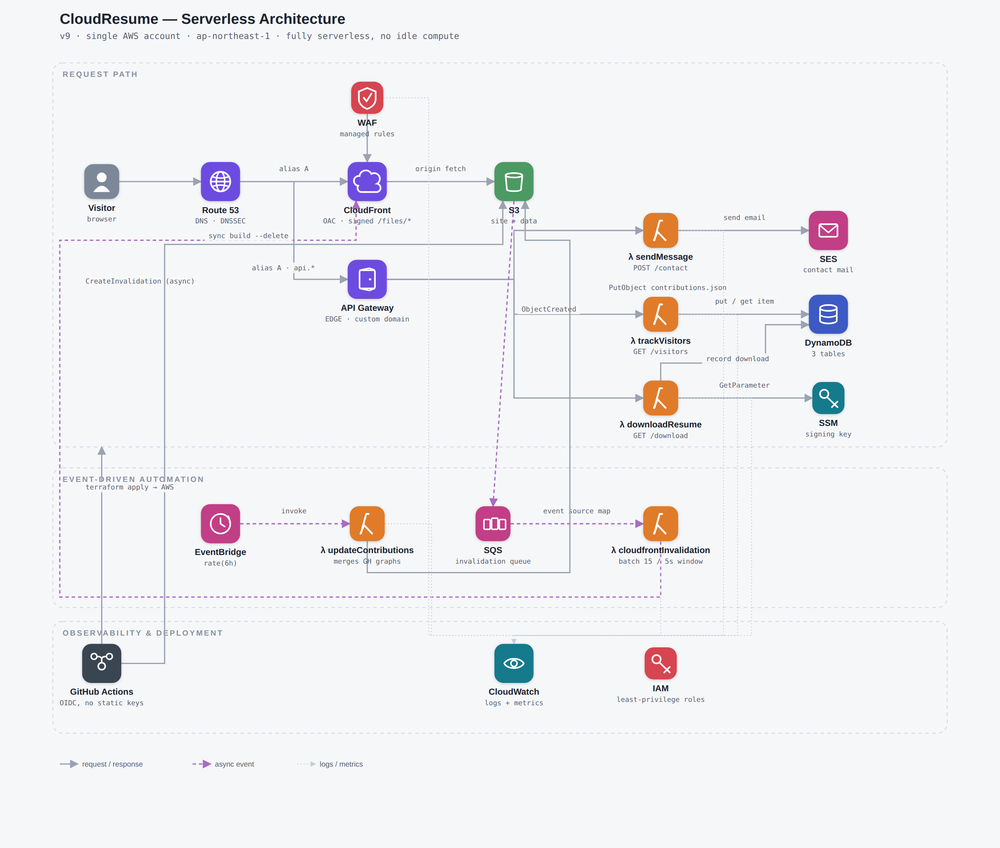

# CloudResume

## Summary
The Cloud Resume Challenge was developed by Forrest Brazeal and is a loosely defined, objective based Cloud Project, setting a number of goals within predefined chunks, while avoiding the trap of being too hand-holdy; The Challenge can be adressed in as simple or complex terms as one chooses, so long as the objective(s) are met.
Completing this Challenge requires a multi-disciplinary approach, covering a wide variety of topics, including (but not limited to): 
+ Fullstack Development
+ Testing
+ Automation
+ Infrastructure
+ Architecture
+ Security
+ Source Control
+ Documentation
+ etc.

The entire challenge culminated in my developing a Single Page WebApp /w API integration, architecting and connecting a variety of AWS services, developing website test scripts, learning how to utilize Infrastructure-as-Code using Terraform, and many other skills.
When I first started this project, I had nearly zero experience in every single technology stack that I leveraged. What began as a way to help reinforce the AWS courses I was following, ended up being a incredibly fun personal project and I'm looking forward to finding the next one.

For a more detailed breakdown of my journey, please read the blog post, linked below.

## Blog Post
My published article can be found on [LinkedIn](https://www.linkedin.com/pulse/taking-cloud-resume-challenge-alexander-bracken-gm0wc/).

## Continuous Integration
Both stacks are built, tested and deployed from a single GitHub Actions pipeline. Pull requests are
gated on unit tests, typechecking, formatting, an end-to-end Cypress run against a locally-served
preview build, a Terraform plan, and lint over the Lambda sources; merges to `main` apply the
reviewed plan, deploy the site, and smoke-test production. Work already proven on a pull request is
not repeated after the merge — see [`docs/ci.md`](docs/ci.md) for how that works and why the pipeline
is shaped the way it is.

## Architectural Overview
**Earlier architectural revisions can be found within the published article, linked above.**
The diagram below tracks the current infrastructure and is maintained in this repo as
[`docs/architecture.svg`](docs/architecture.svg), generated from
[`docs/architecture.gen.mjs`](docs/architecture.gen.mjs) (`node docs/architecture.gen.mjs > docs/architecture.svg`,
no dependencies) so it stays in sync with Terraform instead of a separate design file. It's embedded below as PNG
renders of that SVG, since GitHub serves raw `.svg` files as `text/plain` with `nosniff` set, which keeps browsers
from displaying them through a plain `` reference.

<picture>
  <source media="(prefers-color-scheme: dark)" srcset="docs/architecture-dark.png">
  
</picture>

## Technologies Leveraged
 + Amazon Web Services
   + Organizations
   + IAM Identity Center
   + Identity & Access Management
   + Key Management Service
   + Certificate Manager
   + Route53
   + CloudFront
   + Web Application Firewall
   + API Gateway
   + S3
   + DynamoDB
   + Lambda
   + EventBridge
   + Simple Queue Service
   + Simple Email Service
   + CloudWatch
   + CloudTrail
   + CloudFormation
   + X-Ray
 + Terraform Providers
   + AWS
   + GitHub
   + Random
   + Archive
 + Website
   + Node.js (pnpm)
   + Vite
   + TypeScript
   + React
   + React Router
   + Tailwind CSS
   + Motion / anime.js
   + visx
   + Google reCAPTCHA
 + Testing
   + Vitest / React Testing Library
   + Cypress
 + Language and Syntax
   + HTML
   + CSS
   + Python
   + JavaScript / TypeScript
   + YAML
   + JSON
   + HCL
